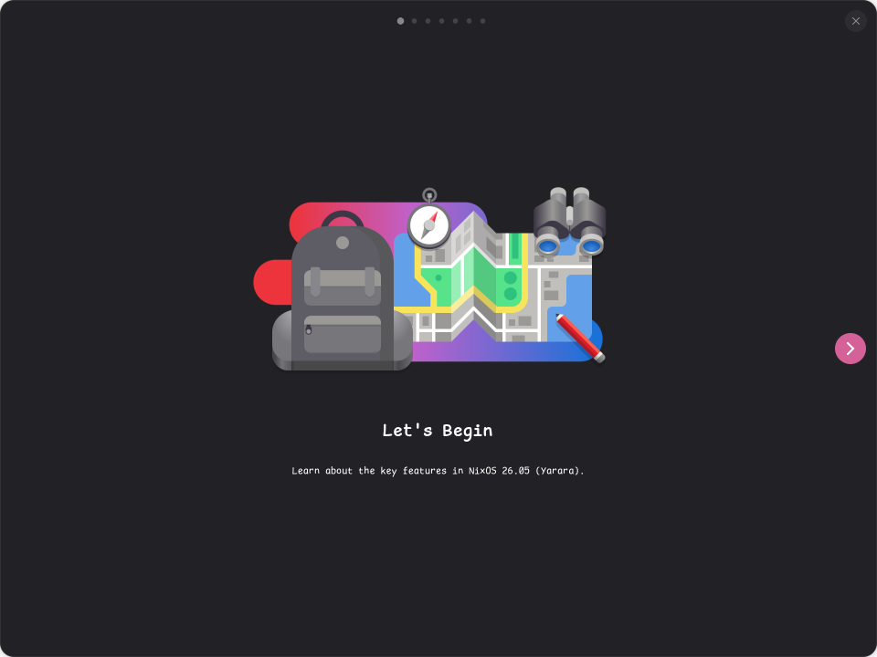

# gnome-tour-rb

A Ruby GTK4 / Libadwaita port of [GNOME Tour](https://gitlab.gnome.org/GNOME/gnome-tour) —
the guided tour that greets you after a fresh GNOME install.



Seven pages in an `AdwCarousel`, three navigation buttons that cross-fade as it
scrolls, and the same 61 translations as upstream.

## Running it

```sh
direnv allow          # or: nix develop
bin/gnome-tour-rb
```

## Testing it

```sh
rake                  # checks, then rubocop
```

`test/catalogue_test.rb` covers the parts that need no display — the PO reader
and the os-release reader. `test/drive_tour.rb` builds the real window, walks
the carousel forward and back through the same actions the buttons trigger, and
writes screenshots to `tmp/shots`. It runs headlessly: GTK4 renders to an
offscreen surface, so those PNGs are what a real session shows.

## How it differs from upstream

Upstream is Rust with GObject subclasses, `.ui` composite templates and a
GResource bundle. This port is plain Ruby in the house declarative style —
every widget is a memoized method, configuration lives in `tap` blocks, and
`build` assembles the tree — so the templates become Ruby and the GResource
becomes files under `data/`. Behaviour is meant to match; the notes in
[PORTING.md](PORTING.md) record where the two had to diverge and why.
